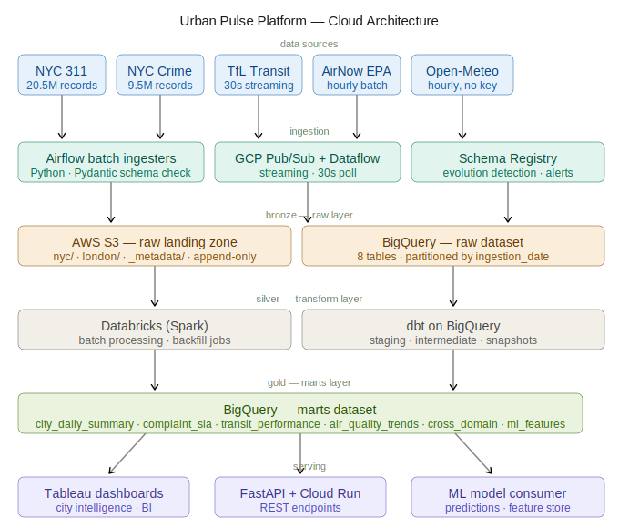

# 🏙️ Urban Pulse Platform

> **Production-grade city intelligence data platform** — ingesting, reconciling, and serving
> real-world public data across 5 domains simultaneously for New York City and London.

[](https://github.com/divyyansh05/urban-pulse-platform/actions/workflows/ci.yml)


---

## What This Is

Most data engineering portfolios use clean CSVs with perfect schemas.
This platform ingests **messy, real-world, live city data** — 20.5M+ 311 complaints,
9.5M+ crime incidents, live transit feeds, hourly air quality, and weather — and
builds a unified intelligence layer that answers questions no single dataset can.

**Core questions this platform answers:**
- Does air quality degrade when the London Underground is disrupted?
- Do NYC 311 noise complaints spike after extreme weather events?
- Which boroughs have the worst 311 SLA compliance — and does weather explain it?
- Can we predict next-hour complaint volume from current AQ + weather features?

---

## Architecture

## Cloud Architecture

```mermaid
flowchart TD
    subgraph SOURCES["📡 DATA SOURCES"]
        S1["NYC 311\n20.5M records\nNear real-time"]
        S2["NYC Crime\n9.5M records\nDaily batch"]
        S3["TfL Transit\nStreaming\n30s poll"]
        S4["AirNow EPA\nHourly batch"]
        S5["Open-Meteo\nHourly batch\nNo key needed"]
    end

    subgraph INGESTION["⚙️ INGESTION LAYER"]
        I1["Batch Ingester\nPython + Airflow\nDAG per source"]
        I2["Stream Ingester\nPub/Sub Publisher\nGCP Dataflow"]
        I3["Schema Validator\nPydantic models\nAt ingestion time"]
    end

    subgraph RAW["🟤 RAW LAYER — Bronze\nAWS S3 + BigQuery\nAppend-only. Never modified."]
        R1["nyc_311_raw"]
        R2["nyc_crime_raw"]
        R3["tfl_line_status_raw\ntfl_arrivals_raw"]
        R4["airnow_observations_raw"]
        R5["weather_observations_raw"]
        R6["_ingestion_log\n_schema_versions"]
    end

    subgraph STAGING["🥈 STAGING LAYER — Silver Part 1\nBigQuery Views\nClean. Cast. Deduplicate. Mask PII."]
        ST1["stg_nyc_311"]
        ST2["stg_nyc_crime"]
        ST3["stg_tfl_line_status\nstg_tfl_arrivals"]
        ST4["stg_airnow\nPivoted pollutants"]
        ST5["stg_weather"]
    end

    subgraph SEEDS["🌱 SEED TABLES\ndbt seeds — static CSVs"]
        SE1["borough_zip_lookup"]
        SE2["tfl_severity_lookup"]
        SE3["wmo_weather_code_lookup"]
        SE4["complaint_type_sla"]
    end

    subgraph INTERMEDIATE["🥈 INTERMEDIATE LAYER — Silver Part 2\nBigQuery Tables\nBusiness logic. Enrich. Join."]
        M1["int_complaints_enriched\n311 + weather + AQ"]
        M2["int_transit_delays\nTfL + weather"]
        M3["int_air_quality_indexed\nRolling averages"]
        M4["int_cross_domain_hourly\nAll domains joined"]
    end

    subgraph SNAPSHOTS["📸 SNAPSHOTS — SCD Type 2\ndbt snapshots"]
        SN1["scd_311_complaint_status\nFull status history"]
        SN2["scd_tfl_line_status\nFull line history"]
    end

    subgraph MARTS["🥇 MARTS LAYER — Gold\nBigQuery Tables\nPartitioned. Clustered. Consumer-ready."]
        G1["mart_city_daily_summary\nBI Dashboards"]
        G2["mart_complaint_sla\nOperational"]
        G3["mart_transit_performance\nAnalytical"]
        G4["mart_air_quality_trends\nAnalytical"]
        G5["mart_cross_domain_correlations\nInsight layer"]
        G6["mart_ml_features\nML Models"]
    end

    subgraph SERVING["🚀 SERVING LAYER"]
        SV1["Tableau Dashboards\nCity Intelligence"]
        SV2["FastAPI\nREST endpoints"]
        SV3["ML Models\nPrediction jobs"]
    end

    subgraph ORCHESTRATION["🎼 ORCHESTRATION — Apache Airflow"]
        O1["batch_311_dag\nbatch_crime_dag"]
        O2["stream_transit_dag"]
        O3["hourly_weather_aq_dag"]
        O4["dbt_transform_dag"]
        O5["quality_check_dag"]
    end

    subgraph QUALITY["✅ DATA QUALITY"]
        Q1["Schema contracts\nAt raw boundary"]
        Q2["dbt tests\nNot null, unique,\naccepted values"]
        Q3["GE checkpoints\nAfter each layer"]
    end

    S1 --> I1
    S2 --> I1
    S3 --> I2
    S4 --> I1
    S5 --> I1
    I1 --> I3
    I2 --> I3
    I3 --> R1
    I3 --> R2
    I3 --> R3
    I3 --> R4
    I3 --> R5
    I3 --> R6
    R1 --> ST1
    R2 --> ST2
    R3 --> ST3
    R4 --> ST4
    R5 --> ST5
    SE1 --> ST1
    SE2 --> ST3
    SE3 --> ST5
    ST1 --> M1
    ST4 --> M1
    ST5 --> M1
    ST3 --> M2
    ST5 --> M2
    ST4 --> M3
    ST1 --> M4
    ST4 --> M4
    ST5 --> M4
    ST3 --> M4
    ST1 --> SN1
    ST3 --> SN2
    M1 --> G1
    M2 --> G1
    M3 --> G1
    M1 --> G2
    SE4 --> G2
    M2 --> G3
    M3 --> G4
    M4 --> G5
    M4 --> G6
    G1 --> SV1
    G2 --> SV1
    G3 --> SV1
    G4 --> SV1
    G5 --> SV2
    G6 --> SV3
    O1 -.->|triggers| R1
    O1 -.->|triggers| R2
    O2 -.->|triggers| R3
    O3 -.->|triggers| R4
    O3 -.->|triggers| R5
    O4 -.->|runs dbt| STAGING
    O4 -.->|runs dbt| INTERMEDIATE
    O4 -.->|runs dbt| MARTS
    O5 -.->|validates| QUALITY
    Q1 -.->|blocks bad data| RAW
    Q2 -.->|validates| STAGING
    Q3 -.->|validates| MARTS

    classDef bronze fill:#CD7F32,color:#fff,stroke:#8B4513
    classDef silver fill:#C0C0C0,color:#000,stroke:#808080
    classDef gold fill:#FFD700,color:#000,stroke:#B8860B
    classDef source fill:#4A90D9,color:#fff,stroke:#2C5F8A
    classDef serving fill:#27AE60,color:#fff,stroke:#1A7A43
    classDef infra fill:#8E44AD,color:#fff,stroke:#5D2D7A

    class R1,R2,R3,R4,R5,R6 bronze
    class ST1,ST2,ST3,ST4,ST5,M1,M2,M3,M4,SN1,SN2 silver
    class G1,G2,G3,G4,G5,G6 gold
    class S1,S2,S3,S4,S5 source
    class SV1,SV2,SV3 serving
    class O1,O2,O3,O4,O5,Q1,Q2,Q3 infra
```



<details>
<summary>Detailed data flow diagram</summary>




---
</details>
## Data Sources

| Source | Domain | Volume | Frequency | Format |
|--------|---------|--------|-----------|--------|
| [NYC Open Data — 311](https://data.cityofnewyork.us/resource/erm2-nwe9.json) | Complaints | 20.5M records | Near real-time | JSON API |
| [NYPD Complaint Data](https://data.cityofnewyork.us/resource/qgea-i56i.json) | Crime | 9.5M records | Daily batch | JSON API |
| [TfL Unified API](https://api.tfl.gov.uk) | Transit | Live events | 30s streaming | REST/JSON |
| [AirNow EPA](https://www.airnowapi.org) | Air Quality | Hourly obs | Hourly batch | JSON API |
| [Open-Meteo](https://open-meteo.com) | Weather | Hourly obs | Hourly batch | JSON API |

---

## Tech Stack

| Layer | Open Source | Cloud |
|-------|-------------|-------|
| Streaming Ingestion | Kafka | GCP Pub/Sub + Dataflow |
| Batch Ingestion | Python + requests | Airflow on Cloud Composer |
| Raw Storage | MinIO | AWS S3 |
| Stream Processing | Apache Flink | GCP Dataflow |
| Warehouse | DuckDB | GCP BigQuery |
| Transformation | dbt Core | dbt Cloud |
| Data Quality | Great Expectations | dbt tests + GE |
| Orchestration | Apache Airflow | Cloud Composer |
| IaC | Terraform | Terraform (GCP + AWS) |
| Observability | Grafana + Prometheus | GCP Monitoring |
| Schema Registry | Confluent OSS | GCP Schema Registry |
| Data Catalog | OpenMetadata | GCP Dataplex |
| CI/CD | GitHub Actions | GitHub Actions |

---

## Data Model

Full model spec: [`docs/architecture/data_model.yml`](docs/architecture/data_model.yml)

### Medallion Architecture

```
Bronze (raw)       → Exact copy of source. Append-only. Never modified.
Silver (staging)   → Cleaned, typed, deduplicated, PII masked. Views.
Silver (intermediate) → Business logic, enrichments, cross-domain joins. Tables.
Gold (marts)       → Aggregated, partitioned, clustered. BI + ML ready.
```

### Table Inventory

| Layer | Tables | Purpose |
|-------|--------|---------|
| Raw | 8 tables | Source-faithful copies + pipeline metadata |
| Staging | 5 views | Clean + cast + deduplicate per domain |
| Intermediate | 4 tables | Enriched + joined + business logic |
| Snapshots | 2 tables | SCD Type 2 — 311 status + TfL line history |
| Marts | 6 tables | Daily summary, SLA, transit, AQ, correlations, ML features |
| Monitoring | 3 tables | Pipeline health, quality results, SLA breaches |

---

## Project Structure

```
urban-pulse-platform/
├── ingestion/          # Batch + streaming ingesters per domain
├── transformation/     # dbt project — staging, intermediate, marts, snapshots
├── orchestration/      # Airflow DAGs, sensors, plugins
├── infrastructure/     # Terraform (GCP + AWS), Docker
├── quality/            # Great Expectations suites + checkpoints
├── governance/         # PII config, lineage, catalog
├── serving/            # FastAPI + feature store
├── monitoring/         # Grafana dashboards, alert rules
├── tests/              # Unit, integration, e2e
├── docs/
│   ├── architecture/   # Data model, architecture diagram, API schemas
│   └── decisions/      # Architecture Decision Records (ADRs)
└── scripts/            # Verification, exploration, utilities
```

---

## Build Progress

| Phase | Description | Status |
|-------|-------------|--------|
| Pre-phase | Repo setup, cloud accounts, tooling | ✅ Done |
| Phase 0 | API exploration, data model, architecture | ✅ Done |
| Phase 1 | Batch ingestion — 311, Crime, Weather, AQ | ✅ Done |
| Phase 2 | Warehouse + dbt transformation layer | ⏳ Pending |
| Phase 3 | Streaming ingestion — TfL live feed | ⏳ Pending |
| Phase 4 | Orchestration + pipeline monitoring | ⏳ Pending |
| Phase 5 | Data quality + schema evolution handling | ⏳ Pending |
| Phase 6 | Data governance, PII, lineage, cataloguing | ⏳ Pending |
| Phase 7 | CI/CD + IaC + production hardening | ⏳ Pending |
| Phase 8 | ML-ready serving layer + dashboards | ⏳ Pending |
| Phase 9 | Open source mirror (DuckDB + MinIO) | ⏳ Pending |

---

## Getting Started

```bash
# Clone and set up environment
git clone https://github.com/divyyansh05/urban-pulse-platform.git
cd urban-pulse-platform
python -m venv .venv && source .venv/bin/activate
pip install -r requirements.txt
pre-commit install

# Copy and fill in credentials
cp .env.example .env

# Verify everything is configured correctly
python scripts/verify_setup.py

# Explore all 5 data source APIs
python scripts/explore_apis.py
```

---

## Architecture Decisions

| ADR | Decision |
|-----|----------|
| [ADR-001](docs/decisions/ADR-001-cloud-architecture.md) | Multi-cloud: AWS S3 raw storage + GCP compute + Databricks processing |

---

## Author

**Divyansh Shrivastava** — Senior Data Engineer \| MSc Sports Analytics (Madrid)

[](https://linkedin.com/in/divyyansh05)
[](https://github.com/divyyansh05)
