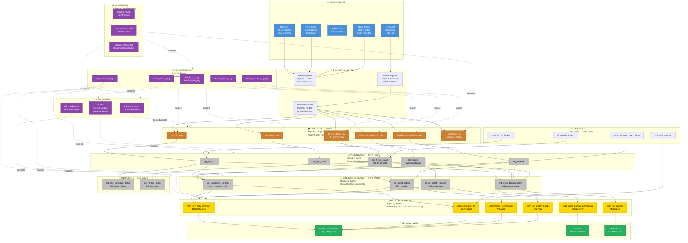

```mermaid
flowchart TD
    subgraph SOURCES["📡 DATA SOURCES"]
        S1["NYC 311\n20.5M records\nNear real-time"]
        S2["NYC Crime\n9.5M records\nDaily batch"]
        S3["TfL Transit\nStreaming\n30s poll"]
        S4["AirNow EPA\nHourly batch"]
        S5["Open-Meteo\nHourly batch\nNo key needed"]
    end

    subgraph INGESTION["⚙️ INGESTION LAYER"]
        I1["Batch Ingester\nPython + Airflow\nDAG per source"]
        I2["Stream Ingester\nPub/Sub Publisher\nGCP Dataflow"]
        I3["Schema Validator\nPydantic models\nAt ingestion time"]
    end

    subgraph RAW["🟤 RAW LAYER — Bronze\nAWS S3 + BigQuery\nAppend-only. Never modified."]
        R1["nyc_311_raw"]
        R2["nyc_crime_raw"]
        R3["tfl_line_status_raw\ntfl_arrivals_raw"]
        R4["airnow_observations_raw"]
        R5["weather_observations_raw"]
        R6["_ingestion_log\n_schema_versions"]
    end

    subgraph STAGING["🥈 STAGING LAYER — Silver Part 1\nBigQuery Views\nClean. Cast. Deduplicate. Mask PII."]
        ST1["stg_nyc_311"]
        ST2["stg_nyc_crime"]
        ST3["stg_tfl_line_status\nstg_tfl_arrivals"]
        ST4["stg_airnow\nPivoted pollutants"]
        ST5["stg_weather"]
    end

    subgraph SEEDS["🌱 SEED TABLES\ndbt seeds — static CSVs"]
        SE1["borough_zip_lookup"]
        SE2["tfl_severity_lookup"]
        SE3["wmo_weather_code_lookup"]
        SE4["complaint_type_sla"]
    end

    subgraph INTERMEDIATE["🥈 INTERMEDIATE LAYER — Silver Part 2\nBigQuery Tables\nBusiness logic. Enrich. Join."]
        M1["int_complaints_enriched\n311 + weather + AQ"]
        M2["int_transit_delays\nTfL + weather"]
        M3["int_air_quality_indexed\nRolling averages"]
        M4["int_cross_domain_hourly\nAll domains joined"]
    end

    subgraph SNAPSHOTS["📸 SNAPSHOTS — SCD Type 2\ndbt snapshots"]
        SN1["scd_311_complaint_status\nFull status history"]
        SN2["scd_tfl_line_status\nFull line history"]
    end

    subgraph MARTS["🥇 MARTS LAYER — Gold\nBigQuery Tables\nPartitioned. Clustered. Consumer-ready."]
        G1["mart_city_daily_summary\nBI Dashboards"]
        G2["mart_complaint_sla\nOperational"]
        G3["mart_transit_performance\nAnalytical"]
        G4["mart_air_quality_trends\nAnalytical"]
        G5["mart_cross_domain_correlations\nInsight layer"]
        G6["mart_ml_features\nML Models"]
    end

    subgraph SERVING["🚀 SERVING LAYER"]
        SV1["Tableau Dashboards\nCity Intelligence"]
        SV2["FastAPI\nREST endpoints"]
        SV3["ML Models\nPrediction jobs"]
    end

    subgraph ORCHESTRATION["🎼 ORCHESTRATION\nApache Airflow\nCloud Composer"]
        O1["batch_311_dag\nbatch_crime_dag"]
        O2["stream_transit_dag"]
        O3["hourly_weather_aq_dag"]
        O4["dbt_transform_dag"]
        O5["quality_check_dag"]
    end

    subgraph QUALITY["✅ DATA QUALITY\nGreat Expectations\ndbt tests"]
        Q1["Schema contracts\nAt raw boundary"]
        Q2["dbt tests\nNot null, unique,\naccepted values"]
        Q3["GE checkpoints\nAfter each layer"]
    end

    subgraph MONITORING["📊 MONITORING\nGrafana + OpenTelemetry"]
        MO1["Pipeline health\nSLA tracking"]
        MO2["Data quality results\nAlert on failure"]
        MO3["Schema change log\nBreaking change alerts"]
    end

    %% Source → Ingestion
    S1 --> I1
    S2 --> I1
    S3 --> I2
    S4 --> I1
    S5 --> I1

    %% Ingestion → Raw
    I1 --> I3
    I2 --> I3
    I3 --> R1
    I3 --> R2
    I3 --> R3
    I3 --> R4
    I3 --> R5
    I3 --> R6

    %% Raw → Staging (dbt)
    R1 --> ST1
    R2 --> ST2
    R3 --> ST3
    R4 --> ST4
    R5 --> ST5

    %% Seeds into Staging
    SE1 --> ST1
    SE2 --> ST3
    SE3 --> ST5

    %% Staging → Intermediate
    ST1 --> M1
    ST4 --> M1
    ST5 --> M1
    ST3 --> M2
    ST5 --> M2
    ST4 --> M3
    ST1 --> M4
    ST4 --> M4
    ST5 --> M4
    ST3 --> M4

    %% Staging → Snapshots
    ST1 --> SN1
    ST3 --> SN2

    %% Intermediate + Seeds → Marts
    M1 --> G1
    M2 --> G1
    M3 --> G1
    M1 --> G2
    SE4 --> G2
    M2 --> G3
    M3 --> G4
    M4 --> G5
    M4 --> G6

    %% Marts → Serving
    G1 --> SV1
    G2 --> SV1
    G3 --> SV1
    G4 --> SV1
    G5 --> SV2
    G6 --> SV3

    %% Orchestration controls everything
    O1 -.->|triggers| R1
    O1 -.->|triggers| R2
    O2 -.->|triggers| R3
    O3 -.->|triggers| R4
    O3 -.->|triggers| R5
    O4 -.->|runs dbt| STAGING
    O4 -.->|runs dbt| INTERMEDIATE
    O4 -.->|runs dbt| MARTS
    O5 -.->|validates| QUALITY

    %% Quality gates
    Q1 -.->|blocks bad data| RAW
    Q2 -.->|validates| STAGING
    Q3 -.->|validates| MARTS

    %% Monitoring reads everything
    MONITORING -.->|observes| ORCHESTRATION
    MONITORING -.->|observes| QUALITY
    MONITORING -.->|observes| R6

    %% Styling
    classDef bronze fill:#CD7F32,color:#fff,stroke:#8B4513
    classDef silver fill:#C0C0C0,color:#000,stroke:#808080
    classDef gold fill:#FFD700,color:#000,stroke:#B8860B
    classDef source fill:#4A90D9,color:#fff,stroke:#2C5F8A
    classDef serving fill:#27AE60,color:#fff,stroke:#1A7A43
    classDef infra fill:#8E44AD,color:#fff,stroke:#5D2D7A

    class R1,R2,R3,R4,R5,R6 bronze
    class ST1,ST2,ST3,ST4,ST5,M1,M2,M3,M4,SN1,SN2 silver
    class G1,G2,G3,G4,G5,G6 gold
    class S1,S2,S3,S4,S5 source
    class SV1,SV2,SV3 serving
    class O1,O2,O3,O4,O5,Q1,Q2,Q3,MO1,MO2,MO3 infra
```
